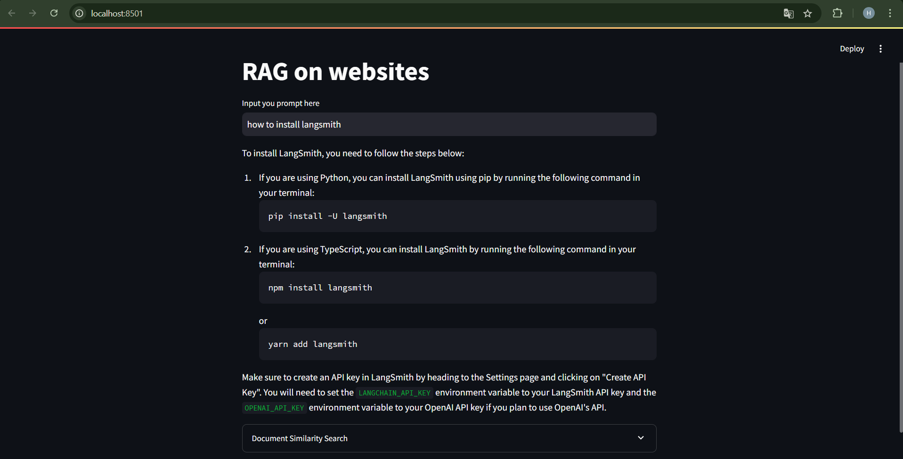

# ChatGroq RAG with Llama2 Embeddings

This repository demonstrates how to create a webpage retrieval system using **Llama2 Embeddings** and **LangChain** with Streamlit for interactive querying. The app uses **Ollama Embeddings** to handle document vectorization and retrieval.

---

## Installation Instructions

Follow the steps below to set up your environment on your local machine:

### 1. **Clone the Repository**
   First, clone the repository to your local machine:
   ```bash
   git clone <repository_url>
   cd <repository_name>
   ```

### 2. **Install Required Libraries**
   Install the required dependencies using `pip`:

   The necessary packages include:
   - **Streamlit**: for the web interface.
   - **LangChain**: for webpage loading, splitting, and querying.
   - **FAISS**: for vector-based document retrieval.
   - **Ollama**: for embeddings.

   To manually install some of the key dependencies:
   ```bash
   pip install streamlit langchain faiss-cpu ollama python-dotenv
   ```

### 3. **Install and Set Up Ollama**
   Install **Ollama** to pull Llama-2 (run cmd/powershell as admin in Windows): 
   ```bash
   choco install ollama #Windows
   ```

   Then, pull the Llama-2 model using Ollama:
   ```bash
   ollama pull llama2
   ```

### 5. **Obtain API Keys**
   - **Groq API Key**: You will need a **Groq** API key.
     ```bash
     os.environ["GROQ_API_KEY"] = "your_groq_api_key_here"
     ```

### 6. **Provide the website link**
    ```python
    st.session_state.loader=WebBaseLoader("https://docs.smith.langchain.com/")
    ```
---

## Running the Application

Once you have the environment set up and the necessary dependencies installed, run the app using Streamlit:

```bash
streamlit run app.py
```

After starting the app, you can input your query in the text box and it will retrieve and answer based on the provided webpage.

---

## Screenshot

Here’s an example of the app's interface:



---

## How it Works

1. **Webpage Loading**: The app uses the `WebBaseLoader` from LangChain to load webpage from a URL.
2. **Text Splitting**: It splits the loaded webpages into chunks using `RecursiveCharacterTextSplitter` for efficient querying.
3. **Embeddings**: The webpage embeddings are generated using **Ollama Embeddings**, which are stored in **FAISS** for fast retrieval.
4. **Retrieval Chain**: The system builds a retrieval chain using `ChatGroq` and LangChain’s document chain functions.
5. **Prompting**: You can ask questions about the webpage, and the system will return relevant answers based on context from the webpage.
